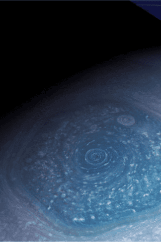
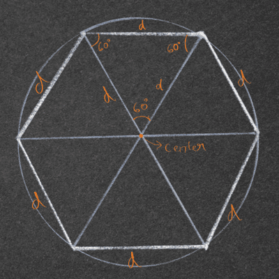
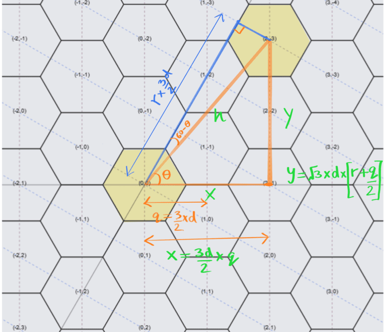

Original Blog Post Link: https://anshulsharma.in/posts/drawing-hexagonal-grids-part-1/
Demo: 

There are just three regular polygons that can perfectly tile a 2D plane: triangles, squares, and hexagons. Let’s face it, squares are too basic. And triangles, well you just cannot trust them. But hexagons? they’re the Goldilocks of shapes—symmetrical, but not annoyingly so. It wasn’t until much later in life that I realized hexagons weren’t just cool to look at, but they also serve a function. They came back into my life when I was working at Uber, where we used the [H3 Hexagonal Grid System](https://www.uber.com/blog/h3/) to divide cities into tiles for better decision-making — whether for surge pricing or dispatching drivers.

It was inevitable that I fell into the hexagonal rabbit hole, I couldn’t help but marvel at how often this six-sided wonder shows up in nature. Take honeycombs, for instance. Honey bees must store the maximum amount of honey (area) with as little wax as possible (perimeter). Technically, a circle provides the greatest surface area for the least amount of perimeter. However, when we use circles to tile the plane, they leave gaps in between. Honey bees cannot afford to waste honey real estate, especially in this economy! Enter hexagons — providing maximum space efficiency while tiling the plane perfectly.

](honeycomb.png)
A natural honeycomb - by [Marian Bijlenga](https://www.flickr.com/photos/marianbijlenga/3841529901/)

If that’s not enough, just glance at Saturn’s north pole. The gas giant flaunts a massive hexagonal cloud system that’s about the size of six Earths! If you are still not convinced on the superiority of Hexagons, watch CGP Grey’s “[Hexagons are the Bestagons](https://youtu.be/thOifuHs6eY)” as the ultimate source of hex gospel.



Saturn’s north pole - credits [stan](https://www.goodfon.com/space/wallpaper-kosmos-planeta-koltsa-saturn-solnechnaia-sistema-saturn-seve.html)

So, when I decided to take on the [20 Games Challenge](https://20_games_challenge.gitlab.io/), I knew hexagons had to be part of the plan. Originally, I wanted to build a Stardew Valley-style RPG with a hex grid, but that would have meant a massive scope for a beginner project. Hence, I’m focusing on a simpler breakout game with my own twist, using hex grids instead of squares. And of course, I’m drawing everything from scratch with vanilla JavaScript and HTML5 canvas. In this first part of a two-part series, I’ll walk you through the geometry of hexagons and how to draw them using JavaScript. In the next post, we’ll make these hexagons interactive and create a breakout game you won’t forget.

## The Axial Coordinate System

A regular hexagon has 6 sides and 6 vertices, and it fits snugly inside a circle where the "size" is the radius of that circle (aka “d”). Now, hexagons divide easily into 6 equilateral triangles, making geometry fun again (don’t run away just yet). It also means that every neighbor of a hexagon is at the same distance from the hexagon. This is unlike the squares, where the distance towards the diagonal square is larger than the vertical and horizontal squares. Equidistant neighbors greatly simplifies algorithms such as the ones used in spatial analysis at Uber.



There is a one downside of hexagons. While the squares may be boring, they tile very well with a (x,y) [Cartesian coordinate system](https://en.wikipedia.org/wiki/Cartesian_coordinate_system). When tiling a plane with hexagons, the 2D Cartesian system gets messy because each row of hexagons is offset by a half step. This makes analysis and algorithm implementation complicated because the entire grid cannot be described just with the (x,y) coordinates and needs another input - offset, to track odd and even rows of hexagons. So we use the axial coordinate system instead. In axial coordinate system, one axis is at a 60 degree angle from the other (instead of the 90 degrees of cartesian coordinates). It simplifies data analysis because the grid can again be described using only two coordinates: (q, r). You can dive deeper into the math with [Amit Patel’s excellent breakdown](https://www.redblobgames.com/grids/hexagons/).

To transform axial coordinates into Cartesian ones, we use the magic of trigonometry, and a trusty _hexToCart()_ function:



```jsx
// Transform Axial coordinates into cartesian coordinates of unit size d (1 unit is a hexagon of radius d)
function hexToCart(h, d) {
	let x = (3 / 2) * h[0] * d;
	let y = Math.sqrt(3) * d * (h[1] + (h[0] / 2));
	return [x, y];
}
```

## Drawing a Hexagon

Once we have those Cartesian coordinates, drawing hexagons is a breeze. The _drawHex()_ function does the heavy lifting, taking the (x, y) center and the hexagon size (d) as inputs:

```jsx
// Draw a single hexagon at the coordinates (x,y) and of size r
function drawHex(x, y, r) {
	ctx.beginPath();
	for (let i = 0; i < 6; i++) {
		let angle = (Math.PI / 3) * i;
		ctx.lineTo(x + r * Math.cos(angle), y + r * Math.sin(angle));
	}
	ctx.closePath();
	ctx.stroke();
}
```

Now, to tile the whole canvas with hexagons, we just loop through the axial coordinates and call _drawHex()_ for each one:

```jsx
// Function to tile the entire canvas using
function fillHexPattern(d, xoffset, yoffset) {
	let q, r, x, y;
	for (q = -n; q <= n; q++) {
		for (r = -n; r <= n; r++) {
			if (Math.max(Math.abs(q), Math.abs(r), Math.abs(-q - r)) < n) {
			[x, y] = hexToCart([q, r], d);
			drawHex(x + xoffset, y + yoffset, d);
			if(showGrid){
				ctx.textAlign = "center";
				ctx.fillText("(" + q + "," + r + ")", x, y);
				}
			}
		}
	}
}
```

And there you have it! All that’s left is to play around with inputs for hex size and orientation. Next time, we’ll spice things up by making the grid interactive and turning it into a breakout game. Stay tuned!

